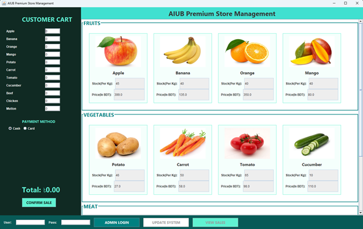

# 🛒 AIUB Premium Store Management System

<p align="center">
  
  
  
  
</p>

---

## 📌 Overview

A **Java GUI-based Store Management System** developed for the **Object-Oriented Programming (OOP-1)** course.

This application simulates a real-world retail store where users can purchase items, while administrators can manage inventory, pricing, and sales records efficiently.

---

## 📅 Project Information

* 📆 **Project Created:** January 17, 2026
* 🎓 **Course:** Object-Oriented Programming (OOP-1)
* 👥 **Team Size:** 2 Members

---

## 👥 Team

* 👤 **A. K. M Shamimul Islam** *(ME)*
* 👤 **Mohammad Tayeb Al Mahdi**

---

## 🚀 Features

### 🛍️ Customer Side

* 🧺 Select items from multiple categories
* ⚡ Real-time total price calculation
* 💳 Payment method selection (Cash / Card)
* 🧾 Automatic receipt generation

### 🔐 Admin Side

* 🔑 Secure login system
* 📦 Update stock and pricing
* 📊 View complete sales history
* 💰 Track total accumulated sales

---

## 🧠 OOP Concepts Used

| Concept      | Implementation          |
| ------------ | ----------------------- |
| Interface    | `Purchasable`           |
| Abstraction  | `CategoryBase`          |
| Inheritance  | Fruits, Vegetable, Meat |
| Polymorphism | Method overriding       |
| Composition  | Checkout system         |

---

## 📂 Project Structure

```
AIUB-Store-Management
 ┣ GUI
 ┃ ┗ AIUBStoreGUI.java
 ┣ Class
 ┃ ┣ Fruits.java
 ┃ ┣ Vegetable.java
 ┃ ┣ Meat.java
 ┃ ┣ CategoryBase.java
 ┃ ┗ Checkout.java
 ┣ Interface
 ┃ ┗ Purchasable.java
 ┣ FileIo
 ┃ ┗ Admin.java
 ┣ Report
 ┃ ┣ inventory.txt
 ┃ ┣ sales.txt
 ┃ ┗ totalSales.txt
 ┣ ss
 ┃ ┗ Picture1.png
 ┗ Main.java
```

---

## 🖥️ Screenshot

<p align="center">
  
</p>

<p align="center">
  📌 Main interface showing product categories, live cart, and admin controls
</p>

---

## ▶️ How to Run

### 🔧 Requirements

* Java JDK 8 or higher
* IntelliJ IDEA / Eclipse / NetBeans / VS CODE

### ▶️ Steps

1. Clone the repository
2. Open in your preferred IDE
3. Ensure the `Report` folder exists
4. Run `Main.java`

---

## 🔑 Admin Credentials

```
Username: aiub@edu
Password: pass1234
```

---

## 📦 Data Storage

| File           | Purpose              |
| -------------- | -------------------- |
| inventory.txt  | Stores stock & price |
| sales.txt      | Stores transactions  |
| totalSales.txt | Stores total sales   |

---

## 💡 System Workflow

1. User selects product quantities
2. System calculates total dynamically
3. On confirming sale:

   * ✅ Validates stock
   * 🔄 Updates inventory
   * 🧾 Generates receipt
   * 💰 Updates total sales

---

## 📊 Sample Output

```
AIUB PREMIUM STORE
------------------------
Apple           x5
Beef            x5
------------------------
TOTAL: ৳6295.00
```

---

## 📖 Learning Outcomes

* ✔️ Strong understanding of OOP principles
* ✔️ Hands-on experience with Java Swing GUI
* ✔️ File handling (read/write operations)
* ✔️ Team collaboration and project structuring
* ✔️ Real-world system simulation

---

## 📜 License

This project is developed for **academic purposes only**.

---

## ⭐ Support

If you found this project helpful, consider giving it a ⭐ on GitHub!

